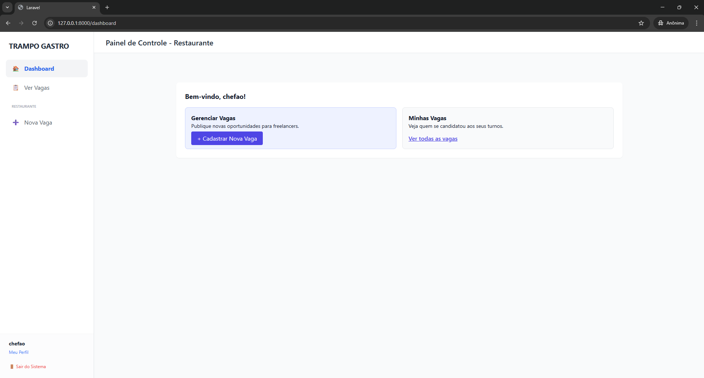

<div align="center">
  
  <h1>🍴 Trampo Gastro</h1>
  <p><b>Arquitetura Full-Stack para Gestão de Freelancers</b></p>

  
  
  
  
</div>

<br>

## 📖 Visão Geral
O **Trampo Gastro** é um ecossistema desenvolvido para automatizar a contratação de garçons freelancers. Diferente de sistemas genéricos, ele aplica regras de negócio rígidas para garantir que o fluxo entre a publicação da vaga e a confirmação na agenda seja à prova de falhas.

---

## 🛡️ Camada de Segurança: O Middleware `checkTipo`
O grande diferencial técnico do projeto é a implementação do **RBAC (Role-Based Access Control)** através de um Middleware customizado. 

Ao contrário de validações simples na View, o `checkTipo` atua na camada de requisição:
<ul>
  <li><b>Isolamento de Rotas:</b> Intercepta a chamada e valida se o <code>Auth::user()->tipo</code> corresponde ao parâmetro esperado (<code>restaurante</code> ou <code>garcom</code>).</li>
  <li><b>Proteção de Kernel:</b> Caso um Garçom tente acessar manualmente a URL de criação de vagas (<code>/vagas/create</code>), o Middleware aborta a operação e redireciona o usuário, garantindo que o Controller nunca processe dados não autorizados.</li>
  <li><b>Consistência:</b> Permite que rotas com nomes semelhantes sejam tratadas com lógicas completamente distintas baseadas no perfil.</li>
</ul>

---

## 🏗️ Engenharia e Persistência

<table width="100%">
  <tr>
    <td width="50%">
      <b>Transactions (ACID)</b><br>
      Utilização de <code>DB::transaction</code> no match de candidaturas. Se a atualização da vaga falhar, a aprovação do garçom é revertida automaticamente, evitando inconsistência.
    </td>
    <td width="50%">
      <b>Eloquent & Query Builder</b><br>
      Abstração completa de SQL para prevenir <i>SQL Injection</i>. Consultas complexas com <code>Join</code> para montar a agenda em tempo real.
    </td>
  </tr>
</table>

---

## 🗄️ Modelo de Dados (Dicionário Técnico)

<table width="100%">
  <thead>
    <tr>
      <th align="left">Entidade</th>
      <th align="left">Papel no Sistema</th>
      <th align="left">Regra de Integridade</th>
    </tr>
  </thead>
  <tbody>
    <tr>
      <td><code>users</code></td>
      <td>Identidade e Credenciais.</td>
      <td>Coluna <code>tipo</code> define o comportamento do Middleware.</td>
    </tr>
    <tr>
      <td><code>restaurantes</code></td>
      <td>Extensão do perfil para empresas.</td>
      <td>Relacionamento 1:1 com <code>users</code> via FK.</td>
    </tr>
    <tr>
      <td><code>vagas</code></td>
      <td>Postagens de oportunidades.</td>
      <td>FK <code>restaurante_id</code>. Status controlado via Transaction.</td>
    </tr>
    <tr>
      <td><code>candidaturas</code></td>
      <td>Vínculo Freelancer-Vaga.</td>
      <td>Unique Constraint entre <code>vaga_id</code> e <code>usuario_id</code>.</td>
    </tr>
  </tbody>
</table>

---

## 📸 Demonstração Visual

<div align="center">
  <b>1. Dashboard com RBAC Ativo</b><br>
  <br><br>
  
  <b>2. Publicação de Vagas (Lógica de Restaurante)</b><br>
  <br><br>

  <b>3. Agenda Confirmada (Lógica de Garçom)</b><br>
  
</div>

---

## ⚙️ Setup de Desenvolvimento

```bash
# Instalação de dependências
composer install && npm install

# Build de Assets & Vite
npm run build

# Configuração de Ambiente
cp .env.example .env && php artisan key:generate

# Migrations & Server
php artisan migrate
php artisan serve
